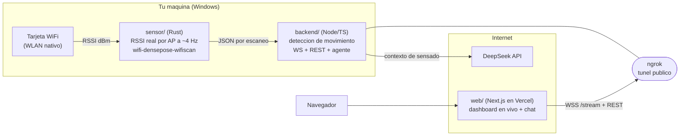
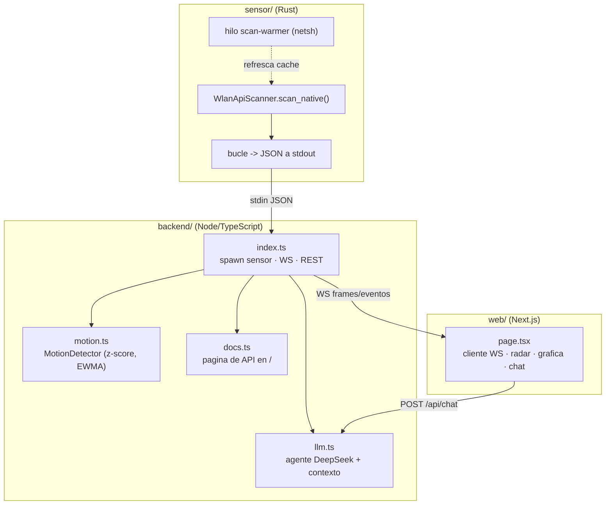
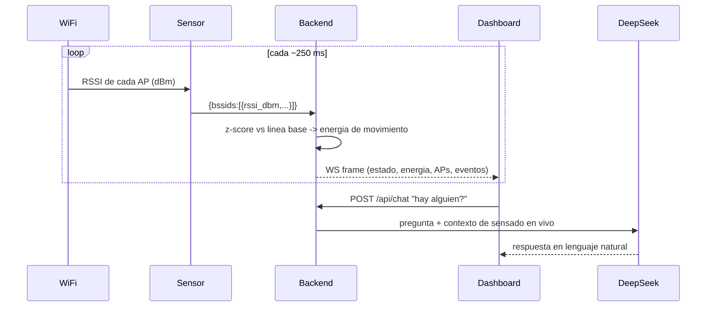
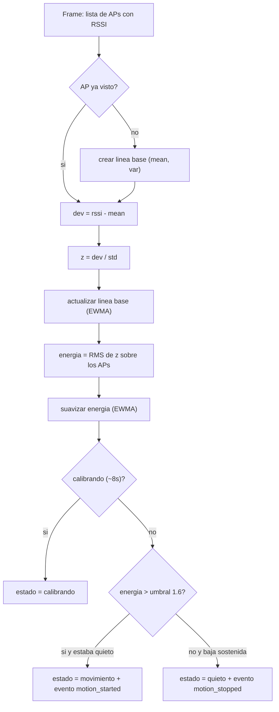

# RuViu — presencia y movimiento con WiFi real + agente LLM

> Convierte una laptop en un sensor de presencia usando el WiFi que ya te rodea.
> Sin cámaras, sin wearables. Detecta **movimiento** con el RSSI real de los routers cercanos,
> lo muestra en un **dashboard en vivo** y un **agente conversacional (DeepSeek)** lo explica e interpreta.

<p align="left">
  
  
  
  
</p>

## En vivo

| Recurso | URL |
|---|---|
| Dashboard (Vercel, público) | **https://ruviu.vercel.app** |
| API del backend (documentación de endpoints en la raíz) | la URL de **ngrok** que apunta a tu backend local |
| Código | https://github.com/DevCristobalvc/ruview-wifi-sensing-poc |

El backend corre en **tu máquina** (sensor WiFi + agente). **ngrok** lo expone a internet para que el
dashboard de Vercel pueda conectarse. Abrir la URL de ngrok en el navegador muestra la documentación
de la API.

**100 % datos reales.** No hay datos simulados en ningún punto del pipeline.

---

## Diagrama de arquitectura (despliegue)



## Diagrama de componentes (módulos internos)



## Diagramas de flujo

**Flujo de datos (por frame y al preguntar al agente):**



**Flujo del algoritmo de detección (dentro de `motion.ts`, por frame):**



## Como funciona (la fisica)

Cada router llena el espacio de ondas de radio que rebotan en paredes, muebles y personas
(*multipath*). Cuando alguien se mueve, cambia esos rebotes y el **RSSI** de cada punto de acceso
fluctua. Por cada AP se mantiene una **linea base adaptativa** (media + varianza con EWMA); la
desviacion instantanea se normaliza en un **z-score**, y el z-score RMS de todos los AP es la
**energia de movimiento**. Si supera el umbral (~1.6) de forma sostenida se marca estado *movimiento*
y un evento de presencia. Es el mismo enfoque de anomalia por z-score de
[ruvnet/ruview](https://github.com/ruvnet/ruview).

## Necesito estar cerca del router?

No. El **sensor es la laptop** (su tarjeta WiFi actua de receptor); los routers son solo los
iluminadores. Lo que importa es estar **en el camino de radio** entre la laptop y los routers:

- Misma habitacion: funciona bien.
- Cerca de la laptop: mucho mejor (caminar o mover los brazos se detecta casi siempre).
- Lejos y con gesto pequeno: puede no registrarse.
- A traves de paredes: se atenua, pero paredes delgadas no lo impiden del todo.

Truco para demostrar: recalibra, quedate quieto y luego muevete cerca del equipo.

## Validarlo en vivo

El dashboard trae un panel **"Validacion en vivo"**: pulsa *Iniciar prueba de movimiento*,
quedate quieto (mide la base), luego muevete (mide el pico) y obten un veredicto
(detectado / no detectado), con los numeros. El boton **Recalibrar** reinicia el aprendizaje.
El agente tambien puede explicarte cualquier duda: preguntale "como funciona?" o
"necesito estar cerca del router?".

## Endpoints (API)

Abrir la URL de ngrok en el navegador muestra esta documentacion con ejemplos.

| Metodo | Ruta | Descripcion |
|---|---|---|
| `WS`   | `/stream` | Frames de sensado + eventos en tiempo real |
| `GET`  | `/api/health` | Estado del servidor y del sensor |
| `GET`  | `/api/state` | Ultimo frame |
| `GET`  | `/api/history` | Historial reciente (`?n=`) |
| `GET`  | `/api/events` | Eventos de movimiento |
| `GET`  | `/api/stats` | Metricas de sesion (uptime, picos, ocupacion) |
| `GET`  | `/api/insight` | Interpretacion (sin LLM) de la tendencia del grafico |
| `POST` | `/api/recalibrate` | Reinicia la linea base |
| `POST` | `/api/chat` | Agente DeepSeek con contexto en vivo |
| `POST` | `/api/analyze` | Resumen en lenguaje natural de la actividad |

## Alcance honesto

- **Movimiento / presencia**: real y funcional desde una laptop (RSSI).
- **Ritmo cardiaco / respiracion**: el algoritmo existe en ruvnet/ruview
  (`wifi-densepose-vitals`, banda 0.8-2.0 Hz + autocorrelacion) pero requiere **CSI
  multi-subportadora de un nodo ESP32-S3** (~USD 9). Una tarjeta WiFi normal no expone CSI.
  Anadir un ESP32-S3 habilitaria vitales **sin cambiar la arquitectura**.

## Estructura

| Carpeta | Que es |
|---|---|
| `sensor/` | Micro-servicio **Rust**: RSSI real via `wifi-densepose-wifiscan` (WLAN nativo de Windows). |
| `backend/` | **Node/TS**: ingesta, deteccion de movimiento, WS/REST, docs en `/` y agente DeepSeek. |
| `web/` | **Next.js** (Vercel): dashboard en vivo, radar, graficas, validacion y chat. |

## Requisitos

- **Windows** con adaptador WiFi activo (el sensor usa la API WLAN nativa).
- **Rust** con toolchain GNU: `rustup toolchain install stable-x86_64-pc-windows-gnu`
  (se usa GNU porque no requiere el linker de Visual Studio).
- **Node.js 20.6+** (usa `process.loadEnvFile`).
- Una **API key de DeepSeek** (https://platform.deepseek.com).
- Opcional: **ngrok** (exponer el backend) y una cuenta de **Vercel** (front).

## Puesta en marcha (paso a paso)

```bash
# 1) Sensor: compila el binario que lee el RSSI real
cd sensor
cargo +stable-x86_64-pc-windows-gnu build --release

# 2) Backend
cd ../backend
cp .env.example .env          # edita .env y pon tu DEEPSEEK_API_KEY
npm install
npm start                     # http://localhost:8090  (documentacion de la API en /)

# 3) Frontend (en otra terminal)
cd ../web
npm install
npm run dev                   # http://localhost:3000

# 4) Exponer el backend para el dashboard en la nube (opcional)
ngrok http 8090
# pega la URL de ngrok en el input del dashboard (se guarda en el navegador)
```

Notas:
- El backend arranca el sensor por ti (variable `SENSOR_CMD`, ya apunta al binario compilado).
- Orden importante: compila el sensor **antes** de arrancar el backend.
- Para el front en local no hace falta ngrok: por defecto se conecta a `http://localhost:8090`.

## Guion de demo (60s)

1. Abre **https://ruviu.vercel.app** y verifica el estado "en vivo" y los APs reales con su RSSI.
2. Pulsa **Recalibrar** y luego **Iniciar prueba de movimiento**: quieto, luego muevete -> "detectado".
3. Senala el radar, la grafica de energia y la interpretacion en vivo reaccionando.
4. Preguntale al agente: "hay alguien en la sala?" y "como funciona esto?".

## Roadmap

- [ ] Alerta a **Telegram** en cada evento de movimiento.
- [ ] Nodo **ESP32-S3** para habilitar ritmo cardiaco/respiracion reales (CSI).
- [ ] Dominio **ngrok fijo** (estable entre reinicios) y multi-AP mas robusto.

## Creditos y licencia

Basado en [ruvnet/ruview](https://github.com/ruvnet/ruview) y su crate
[`wifi-densepose-wifiscan`](https://crates.io/crates/wifi-densepose-wifiscan). MIT.
