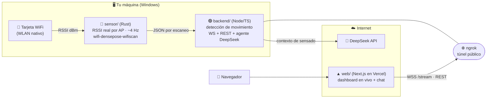
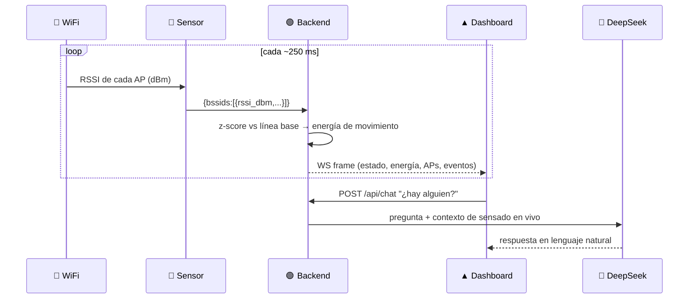

# π RuViu — presencia y movimiento con WiFi real + agente LLM

> **Convierte una laptop en un sensor de presencia usando el WiFi que ya te rodea.**
> Sin cámaras, sin wearables. Detecta **movimiento** con el RSSI real de los routers cercanos,
> lo muestra en un **dashboard en vivo** y un **agente conversacional (DeepSeek)** lo explica e interpreta.

<p align="left">
  
  
  
  
</p>

## 🔗 En vivo

| Recurso | URL |
|---|---|
| 🖥️ **Dashboard** (Vercel, público) | **https://ruviu.vercel.app** |
| 📡 **API del backend** (docs de endpoints en la raíz) | la URL de **ngrok** que apunta a tu backend local |
| 💻 **Código** | https://github.com/DevCristobalvc/ruview-wifi-sensing-poc |

> El backend corre en **tu máquina** (sensor WiFi + agente). **ngrok** lo expone a internet
> para que el dashboard de Vercel pueda conectarse. Abrir la URL de ngrok en el navegador
> muestra la **documentación de la API**.

> **100 % datos reales.** No hay datos simulados en ningún punto del pipeline.

---

## 🧠 Arquitectura



**Flujo de un frame:**



## ⚙️ Cómo funciona (la física)

Cada router llena el espacio de ondas de radio que rebotan en paredes, muebles y personas
(*multipath*). Cuando alguien se mueve, cambia esos rebotes y el **RSSI** de cada punto de acceso
fluctúa. Por cada AP se mantiene una **línea base adaptativa** (media + varianza con EWMA); la
desviación instantánea se normaliza en un **z-score**, y el z-score RMS de todos los AP es la
**“energía de movimiento”**. Si supera el umbral (~1.6) de forma sostenida → estado *movimiento* y
evento de presencia. Es el mismo enfoque de anomalía por z-score de [ruvnet/ruview](https://github.com/ruvnet/ruview).

## 📍 ¿Necesito estar cerca del router?

**No.** El **sensor es la laptop** (su tarjeta WiFi actúa de receptor); los routers son solo los
“iluminadores”. Lo que importa es estar **en el camino de radio** entre la laptop y los routers:

- **Misma habitación** → funciona bien.
- **Cerca de la laptop** → mucho mejor (caminar o mover los brazos se detecta casi siempre).
- **Lejos + gesto pequeño** → puede no registrarse.
- **A través de paredes** → se atenúa, pero paredes delgadas no lo impiden del todo.

Truco para demostrar: **recalibra → quédate quieto → muévete cerca del equipo.**

## ✅ Validarlo en vivo

El dashboard trae un panel **“Validación en vivo”**: pulsa *Iniciar prueba de movimiento*,
quédate quieto (mide la base), luego muévete (mide el pico) y obtén un **veredicto
✅ detectado / ❌ no**, con los números. El botón **Recalibrar** reinicia el aprendizaje.
El agente también puede explicarte cualquier duda: pregúntale *“¿cómo funciona?”* o *“¿necesito estar cerca del router?”*.

## 🔌 Endpoints (API)

Abrir la URL de ngrok en el navegador muestra esta documentación con ejemplos.

| Método | Ruta | Descripción |
|---|---|---|
| `WS`   | `/stream` | Frames de sensado + eventos en tiempo real |
| `GET`  | `/api/health` | Estado del servidor y del sensor |
| `GET`  | `/api/state` | Último frame |
| `GET`  | `/api/history` | Historial reciente (`?n=`) |
| `GET`  | `/api/events` | Eventos de movimiento |
| `GET`  | `/api/stats` | Métricas de sesión (uptime, picos, ocupación) |
| `GET`  | `/api/insight` | Interpretación (sin LLM) de la tendencia del gráfico |
| `POST` | `/api/recalibrate` | Reinicia la línea base |
| `POST` | `/api/chat` | Agente DeepSeek con contexto en vivo |
| `POST` | `/api/analyze` | Resumen en lenguaje natural de la actividad |

## 🎯 Alcance honesto

- ✅ **Movimiento / presencia**: real y funcional desde una laptop (RSSI).
- ❌ **Ritmo cardíaco / respiración**: el algoritmo existe en ruvnet/ruview
  (`wifi-densepose-vitals`, banda 0.8–2.0 Hz + autocorrelación) pero requiere **CSI
  multi-subportadora de un nodo ESP32-S3** (~USD 9). Una tarjeta WiFi normal no expone CSI.
  Añadir un ESP32-S3 habilitaría vitales **sin cambiar la arquitectura**.

## 🗂️ Estructura

| Carpeta | Qué es |
|---|---|
| `sensor/` | Micro-servicio **Rust**: RSSI real vía `wifi-densepose-wifiscan` (WLAN nativo de Windows). |
| `backend/` | **Node/TS**: ingesta, detección de movimiento, WS/REST, docs en `/` y agente DeepSeek. |
| `web/` | **Next.js** (Vercel): dashboard en vivo, radar, gráficas, validación y chat. |

## 🚀 Puesta en marcha

**Requisitos:** Windows con WiFi · **Rust** (toolchain GNU: `rustup toolchain install stable-x86_64-pc-windows-gnu`) · **Node 20.6+** · una **API key de DeepSeek** · opcional **ngrok** y **Vercel**.

```bash
# 1) Sensor (RSSI real)
cd sensor
cargo +stable-x86_64-pc-windows-gnu build --release

# 2) Backend
cd ../backend
cp .env.example .env          # pon tu DEEPSEEK_API_KEY
npm install
npm start                     # http://localhost:8090  (docs de API en /)

# 3) Frontend
cd ../web
npm install
npm run dev                   # http://localhost:3000

# 4) Exponer el backend para el dashboard en la nube
ngrok http 8090
# pega la URL de ngrok en el input del dashboard (se guarda en el navegador)
```

## 🎬 Guion de demo (60s)

1. Abre **https://ruviu.vercel.app** → verifica “en vivo” y los APs reales con su RSSI.
2. **Recalibrar** → **Iniciar prueba de movimiento** → quieto, luego muévete → **✅ detectado**.
3. Señala el **radar**, la **gráfica de energía** y la **interpretación en vivo** reaccionando.
4. Pregúntale al **agente**: *“¿hay alguien en la sala?”* y *“¿cómo funciona esto?”*.

## 🗺️ Roadmap

- [ ] Alerta a **Telegram** en cada evento de movimiento.
- [ ] Nodo **ESP32-S3** para habilitar ritmo cardíaco/respiración reales (CSI).
- [ ] Dominio **ngrok fijo** (estable entre reinicios) y multi-AP más robusto.

## 📄 Créditos y licencia

Basado en [ruvnet/ruview](https://github.com/ruvnet/ruview) y su crate
[`wifi-densepose-wifiscan`](https://crates.io/crates/wifi-densepose-wifiscan). MIT.
